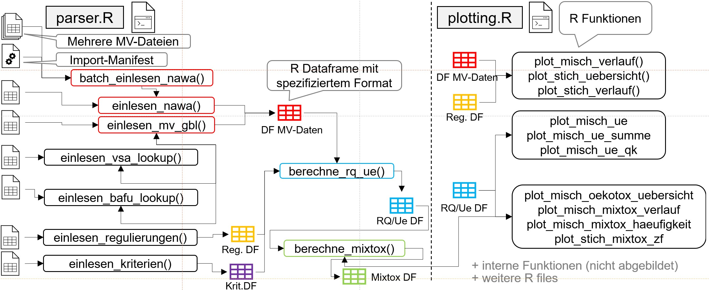

<!-- README.md is generated from README.Rmd. Please edit that file -->

# mvwizr 

<!-- badges: start -->

[](https://github.com/ror-at-ebp/mvwizr/actions/workflows/R-CMD-check.yaml)

[](https://app.codecov.io/gh/ror-at-ebp/mvwizr)
<!-- badges: end -->

## Übersicht

mvwizr soll die visuelle Auswertung von Mikroverunreinigungen (MV) in
Schweizer Gewässern gemäss dem
[Modul-Stufen-Konzept](https://modul-stufen-konzept.ch/) erleichtern.
Das Paket basiert auf einem Auftrag des Gewässer- und Bodenschutzlabor
des Kantons Bern (GBL) an EBP Schweiz. Die Auswertungs- und
Plotfunktionen sind aber bewusst so konzipiert, dass sie auch mit
MV-Daten anderer Kantone funktionieren können. Insbesondere unterstützt
mvwizr auch das NAWA (Nationale Beobachtung
Oberflächengewässeruqalität)-Datenformat, das von verschiedenen Kantonen
verwendet wird. Das Paket ist modular aufgebaut und kann daher leicht
erweitert werden, um weitere Funktionen oder Datenformate zu
unterstützen.

## Installation

mvwizr ist nicht auf CRAN veröffentlicht und kann daher am Einfachsten
direkt von github installiert werden. Das Paket benötigt mindestens R
4.1. Alternativ kann das Paket z.B. auch auf [Posit
Cloud](https://posit.cloud/) installiert und getestet werden. Für die
Installation auf einem lokalen Rechner (Windows/macOS/Linux) folgende
Kommandos ausführen:

``` r
install.packages("pak") # falls noch nicht installiert
pak::pkg_install("ror-at-ebp/mvwizr")
```

## Updates

Das Paket wird sporadisch aktualisiert zwecks Fehlerbehebung,
Erweiterung der Funktionen und Aktualisierung der Daten (BAFU-ID-Lookup,
Qualitätskriterien des Ökotoxzentrums, VSA-ID-Lookup, Rechtliche
Anforderungen). Um das Paket zu aktualisieren, kann der gleiche Befehl
wie bei der Installation verwendet werden. Dabei sollte eine Meldung wie
die folgende erscheinen:

    → Will update 1 package.
    → The package (0 B) is cached.
    + mvwizr 1.0.0 → 1.1.0 [bld][cmp] (GitHub: 35d7e78)

### Übersicht über aktuell gebundelte Daten

- BAFU-ID-Lookup (“BAFU_Liste_Parameter_Bezeichnungen_Datenaustausch”):
  Version 12.2024
- Dat Qualitätskriterien des Ökotoxzentrums: Version Juni 2025 (Auszug
  vom VSA)
- Tab Substanzen des VSA: Auszug aus Datenbank Juli 2025
- Tab Anforderungen Recht des VSA: Version Juni 2025

## Verwendung

Das Paket stellt verschiedene Funktionen zum Umgang mit MV-Daten bereit
vom Einlesen, über das Auswerten/Berechnen bis (hauptsächlich) zum
Visualisieren. Viele Funktionen sind für Mischproben gedacht und
unterstützen sowohl eine Auswertung für kurzzeitige Verunreinungen als
auch für andauernde Verunreinigungen.

### Erste Schritte

Nach der Installation kann mvwizr in Scripts oder in der Konsole
verwendet werden, indem das Paket geladen wird:

``` r
library(mvwizr)
```

Eine Einführung in die Verwendung des Pakets findet sich auf der
[Paketwebseite](https://ror-at-ebp.github.io/mvwizr/articles/mvwizr.html).
Dort sind auch verschiedene Hilfe-Artikel zu finden, die die Verwendung
des Pakets demonstrieren.

### Hilfe erhalten

Das Paket enthält verschiedene eingebaute Möglichkeiten, Hilfe zu
erhalten:

- `?funktion`: Zeigt die Hilfe für eine bestimmte Funktion an, also z.B.
  `?einlesen_mv_gbl`.
- `??mvwizr`: Zeigt die Hilfeseiten zu den gebundelten Beispieldaten an.

Daneben sind für die meisten Funktionen auch Beispiele in den
Hilfeseiten enthalten, die die Verwendung der Funktionen demonstrieren.
Auf der Paketwebseite sind zudem Artikel mit spezifischen Hilfethemen
veröffentlicht: <https://ror-at-ebp.github.io/mvwizr/>.

Folgende Funktionen werden vom Paket exportiert und können direkt
verwendet werden:

### Einlesen

Alle Funktionen zum Einlesen und Berechnen sind in der Datei
`R/parsing.R` enthalten.

- `einlesen_nawa()`: Liest einzelne MV-Dateien (oder Dataframes) im
  NAWA-Format ein, normalisiert Einheiten, entfernt Duplikate, bestimmt
  Bestimmungsgrenzen aus Daten und verknüpft Daten mit der VSA
  Substanz_ID. Für das Einlesen notwendige Parameter können der Funktion
  als Argumente übergeben werden. Test-Daten werden mitgeliefert (siehe
  Beispiele im Hilfetext der Funktion).
- `batch_einlesen_nawa()`: Liest mehrere NAWA-MV-Daten-Dateien ein,
  entweder über ein Import-Manifest oder eine Liste von Dateipfaden. Die
  Funktion kann auch die Parameter wie Encoding, Header, Delimiter und
  Sprache erraten, wenn diese nicht angegeben sind in Form eines
  Import-Manifests (oder nur teilweise).
- `schreibe_schreibe_nawa_import_manifest_template()`: Erstellt ein
  Excel-Template für ein Import-Manifest, das für die Funktion
  `batch_einlesen_nawa()` verwendet werden kann. Der Pfad zu den
  MV-Dateien kann angegeben werden um diese in das Template zu
  schreiben. Das Manifest kann dann angepasst werden, um die Parameter
  für das Einlesen der NAWA-Daten zu definieren.
- `einlesen_mv_gbl()`: Liest die MV-Daten des GBL ein, normalisiert
  Einheiten, entfernt Duplikate, bestimmt Bestimmungsgrenzen aus Daten
  und verknüpft Daten mit der VSA Substanz_ID. Test-Daten werden
  mitgeliefert (siehe Beispiele im Hilfetext der Funktion).
- `einlesen_bafu_lookup()`: Liest die Lookup-Tabelle
  `BAFU_Liste_Parameter_Bezeichnungen_Datenaustausch.xlsx` des BAFU aus.
  Diese kann verwendet werden, um z.B. die französische Übersetzung
  einer Substanz zu erhalten. Eine Kopie der Datei wird mitgeliefert
  (siehe Beispiele im Hilfetext der Funktion).
- `einlesen_kriterien()`: Liest die Qualitätskriterien des VSA ein und
  entfernt Duplikate (Bevorzugung tieferer CQK und AQK für die Auswahl).
  Eine Kopie der Datei wird mitgeliefert (siehe Beispiele im Hilfetext
  der Funktion).
- `einlesen_regulierungen()`: Liest die MV-Regulierungen des VSA ein
  (diese Tabelle ist immer nur ein Auszug aus der VSA-Datenbank). Eine
  aktuelle Kopie der Datei wird mitgeliefert (siehe Beispiele im
  Hilfetext der Funktion).
- `einlesen_vsa_lookup()`: Liest die VSA-Lookup-Tabelle ein, die ein
  Bezug zwischen Parameter-ID des BAFU und der VSA Substanz_ID
  herstellt. Eine aktuelle Kopie der Datei wird mitgeliefert (siehe
  Beispiele im Hilfetext der Funktion).

Für alle obigen Funktionen werden mit dem Paket aktuelle Kopien der
betreffenden Dateien verteilt. Es ist allerdings auch möglich, eigene
Dateien zu verwenden, sofern diese der Formatspezifikation entsprechen
(siehe `vignette("datei-spezifikationen")`). Auch werden bereits
eingelesene Daten als Objekte im Paket zur Verfügung gestellt (siehe
Vignette).

### Berechnungen

- `berechne_rq_ue()`: Berechnet Risikoquotienten und Überschreitungen
  für AQK und CQK. Output dient als Grundlage für diverse
  Plot-Funktionen
- `berechne_mixtox()`: Berechnet Mischungstoxizitäten aus dem Output von
  `berechne_rq_ue()`
- `einheiten_normalisieren()`: Hilfsfunktion, um bei MV-Daten mit
  verschiedenen Einheiten (je nach Substanz) überall die gleiche Einheit
  zu verwenden (Standard: µg/l - wird durch Plotting-Funktionen
  erwartet).

### Visualisierungen

Alle Funktionen zum Plotten sind in der Datei `R/plotting.R` enthalten.

- `plot_misch_verlauf()`: Konzentrationsverläufe für Einzelsubstanzen,
  mehrere Substanzen und Summen (auch gruppiert) in verschiedenen
  Darstellungsarten.
- `plot_misch_ue()`: Verlauf von GSchV-Überschreitungen (entweder für
  kurzzeitige oder andauernde Belastungen) pro Substanz und für eine
  Station.
- `plot_misch_ue_summe()`: Verlauf von GSchV-Überschreitungen pro Jahr
  und Station mit Unterscheidung nach Überschreitung von numerischem
  Grenzwert (GSchV Anh. 2) oder allgemeinem Wert für org. Pestizide (0.1
  µg/l).
- `plot_misch_ue_qk()`: Überschreitungen von QK (für Substanzen ohne
  spezifischen Anforderungswert in GSchV Anh. 2; entweder CQK oder AQK)
  im Verhältnis zu Überschreitungen der Substanzen, die in der GSchV
  aufgelistet sind. Mit Option für detaillierte Darstellung (mit
  einzelnen Substanzen) für den Vergleich verschiedener Stationen.
- `plot_misch_oekotox_uebersicht()`: Stationsübersicht Ökotoxbeurteilung
  (Einzelstoffe und Mischungstoxizität) pro Station und Jahr. Entweder
  für kurzzeitige oder andauernde Belastungen.
- `plot_misch_mixtox_verlauf()`: Zeitreihe der Mischungstoxizität für
  mehrere Stationen und Jahre gleichzeitig
- `plot_misch_mixtox_haeufigkeit()`: Zeitreihe der Häufigkeitsverteilung
  der Mischungstoxizität für eine Station (für kurzzeitige oder
  andauernde Belastungen)
- `plot_stich_uebersicht()`: Übersicht über Stichproben mittels
  Raster-Darstellung über die Zeit für eine Station. Die Konzentrationen
  werden dabei durch Farben in logarithmischer Skala dargestellt,
  wodurch schnell relevante Substanzen identifiziert werden können.
- `plot_stich_verlauf()`: Konzentrationsverlauf für Stichproben für
  mehrere Substanzen und Stationen. Gut geeignet für eine interaktive
  Analyse mit Plotly.

Die Rückgaben der Plot-Funktionen sind `ggplot2`- oder
`patchwork`-Objekte, die weiter bearbeitet werden können, z.B.:

``` r
plot1 <- plot_misch_verlauf(mvdaten_beispiel_mvwizr, regulierungen_mvwizr, stationscode = "URT010", plot_typ = "barplot", id_substanz = 71,plot_bg = FALSE)
plot1 + ylim(0,0.02)
```

## Struktur des github-Repository

Das Paket ist in verschiedene Verzeichnisse unterteilt:

- `R/`: Enthält die R-Skripte, die die Funktionen des Pakets definieren.
  Die Funktionen sind in zwei Dateien unterteilt: `parsing.R` für
  Einlese- und Berechnungsfunktionen und `plotting.R` für Plotfunktionen
  (und noch Hilfsdateien wie `utils-pipe.R`).
- `data/`: Enthält die Beispieldaten, die mit dem Paket verteilt werden.
  Diese Daten sind in R-Objekten gespeichert und können direkt verwendet
  werden. Nicht manuell anpassen.
- `data-raw/`: Enthält die Skripte, die die Beispieldaten für das Paket
  erstellen. Die Beispieldaten sind im Verzeichnis `data/` gespeichert.
- `inst/extdata`: Enthält zusätzliche Dateien, die mit dem Paket
  verteilt werden, z.B. die Kopien der MV-Dateien des GBL oder
  NAWA-MV-Beispieldateien, die mit dem Paket eingelesen werden können.
- `man/`: Enthält die aus Roxygen-Tags automatisch erstellte
  Dokumentation des Pakets. Nicht manuell anpassen.
- `tests/`: Enthält die Tests für das Paket, die mit dem Paket
  `testthat` geschrieben werden.
- `vignettes/`: Enthält die Vignetten des Pakets, die die Verwendung des
  Pakets demonstrieren. Die Vignetten sind in RMarkdown geschrieben und
  können mit `vignette("name-der-vignette")` aufgerufen werden.
- `AUTHORS.md`: Enthält die Autoren des Pakets
- `CHANGELOG.md`: Kann Angaben zu Änderungen in den verschiedenen
  Versionen des Pakets enthalten.
- `DESCRIPTION`: Enthält die Metadaten des Pakets, wie Name, Version,
  Autoren, Abhängigkeiten, etc.
- `LICENSE`: Enthält die Lizenz des Pakets.
- `mvwizr.Rproj`: Das RStudio-Projekt des Pakets.
- `NAMESPACE`: Enthält die Definition der Funktionen, die exportiert
  werden sollen, und der Abhängigkeiten des Pakets. Nicht manuell
  anpassen.
- `NEWS.md`: Enthält Neuigkeiten zum Paket, die in den verschiedenen
  Versionen hinzugefügt wurden.
- `README.md`: Enthält die automatisch erstellte README-Datei des Pakets
  für Github. Nicht manuell anpassen.
- `README.Rmd`: Enthält die README-Datei des Pakets, die in eine
  README.md-Datei umgewandelt wird.
- `scratchpad.R`: Enthält Code-Schnipsel, die für das Austesten des
  Pakets nützlich sind (nicht in installierter Version des Pakets
  enthalten).

Die Funktionen im Paket hängen wie in der nachfolgenden Abbildung
dargestellt zusammen (mit den jeweiligen Input-Dateien und
Output-Objekten):



## Das Paket erweitern

Das Paket kann durch Hinzufügen neuer Funktionen und Daten erweitert
werden. Eine Checkliste für das Veröffentlichen von Updates findet sich
in der Datei `RELEASE_RUN.md` im Hauptverzeichnis des Repository. Hier
sind einige weitere Schritte, die befolgt werden sollten, um das Paket
zu erweitern:

1.  **Neue Funktionen hinzufügen**: Neue R-Skripte im `R`-Verzeichnis
    erstellen (oder die Dateien `parsing.R` und `plotting.R` ergänzen)
    und Funktionen dort definieren. Sicherstellen, dass die Funktionen
    mit Roxygen-Tag dokumentiert und exportiert werden, damit sie für
    Benutzer verfügbar sind. Falls die Funktionen Dataframes
    zurückliefern, sollte die Struktur dieser Dataframes ebenfalls
    definiert werden (z.B. in der Dokumentation der Beispieldaten im
    nächsten Schritt).

2.  **Daten hinzufügen**: Mittels Scripts im Verzeichnis `data-raw`
    Datensätze erstellen und mit der Funktion `usethis::use_data()` die
    Daten im Paket abspeichern. Das Updaten dieser Daten muss manuell
    gemacht werden. Auch sollten die Daten dokumentiert werden (siehe
    bestehende Daten mit Dokumentation unter R/data.R).

3.  **Dokumentation aktualisieren**: Die Dokumentation des Pakets
    aktualisieren, einschliesslich der Vignetten und der Hilfeseiten für
    die neuen Funktionen und Daten. `roxygen2` zur Generierung der
    Dokumentation verwenden (wird in RStudio automatisiert).

4.  **Tests hinzufügen**: Tests für die neuen Funktionen hinzufügen, um
    sicherzustellen, dass sie korrekt funktionieren. Das
    `testthat`-Paket verwenden und Tests im `tests/testthat`-Verzeichnis
    speichern.

5.  **Build und Check**: `devtools::build()` und `devtools::check()`
    ausführen, um sicherzustellen, dass das Paket der R CMD CHECK ohne
    Fehler oder Warnungen besteht. Der R CMD CHECK wird auch
    automatisiert bei jedem Push auf den `main`-Branch des
    GitHub-Repository ausgeführt. Dabei sollten keine Fehler und
    Warnungen auftreten.

6.  **Styleguide**: Der Code sollte dem [Tidyverse
    Styleguide](https://style.tidyverse.org/) entsprechen. Dies kann mit
    dem Paket `styler` automatisiert werden. Folgende Punkte für das
    Erstellen oder erweitern von Funktionen sollten ebenfalls beachtet
    werden:

    1.  Funktionen sollten möglichst kurz und einfach gehalten werden.
        Falls eine Funktion zu lang wird, sollte sie in mehrere kleinere
        Funktionen aufgeteilt werden.
    2.  Rückgabewerte von Funktionen müssen typstabil sein, d.h. die
        Funktion sollte immer denselben Typ zurückgeben, unabhängig von
        den Eingabeparametern.
    3.  Funktionen sollten möglichst keine Seiteneffekte haben, d.h. sie
        sollten keine globalen Variablen verändern oder auf Dateien
        schreiben. Wo dies nicht möglich ist (Funktionen zum Lessen und
        Schreiben, Funktionen, die direkt plotten, oder Funktionen, die
        auf globale Variablen angewiesen sind), sollte dies in der
        Dokumentation explizit erwähnt werden.
    4.  Funktionsaufrufe sollten immer explizit mit der Angabe des
        Namespaces sein, d.h. `dplyr::filter()` statt `filter()`.
        Dadurch entstehen keine Konflikte (z.B. mit `stats::filter()`).
        Die Ausnahme davon sind gewisse Operatoren (z.B. Magrittr-Pipe
        `%>%`), die nicht explizit mit dem Namespace aufgerufen werden
        müssen, da Sie mit expliziten `@importFrom`-Direktiven in der
        `NAMESPACE`-Datei importiert werden (siehe Imports in
        `utils-pipe.R` und `mvwizr-package` - automatisiert mit
        usethis).
    5.  Für das Programmieren mit tidyverse-Funktionen müssen aufgrund
        der non-standard-evaluation durch tidyverse einige spezielle
        Konventionen beachtet werden (z.B. die Verwendung der `.data`
        und `.env`-Pronomen in Funktionen, die data-masking verwenden).
        Diese speziellen Konventionen sind im Artikel [Programming with
        dplyr](https://dplyr.tidyverse.org/articles/programming.html)
        beschrieben. Weitere fortgeschrittene Konzepte sind im eBook
        [Advanced R](https://adv-r.hadley.nz/) von Hadley Wickham
        beschrieben.

Durch das Befolgen dieser Schritte kann das mvwizr-Paket erweitert und
an spezifische Anforderungen angepasst werden. Dabei sollte stets die
Dokumentation aktuell gehalten werden und die Versionierung angepasst
werden (mit `usethis::use_version()`).
