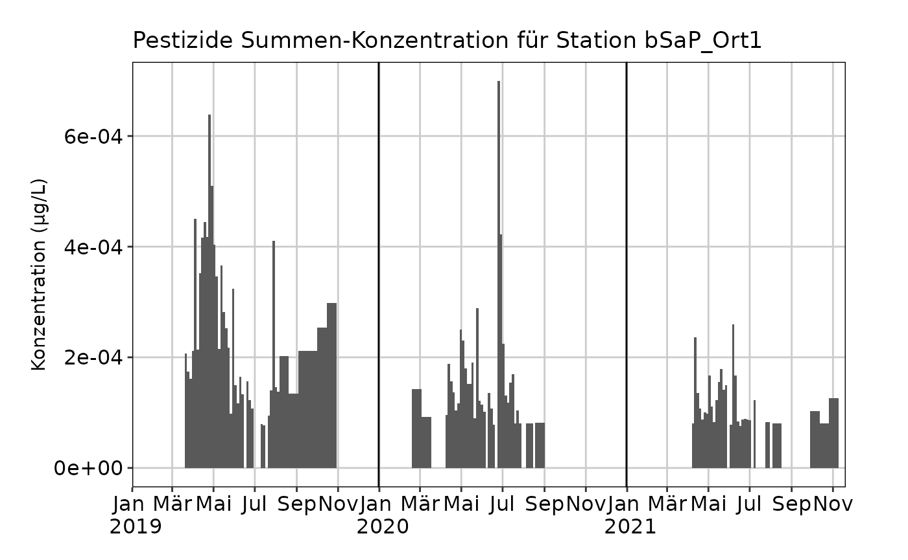
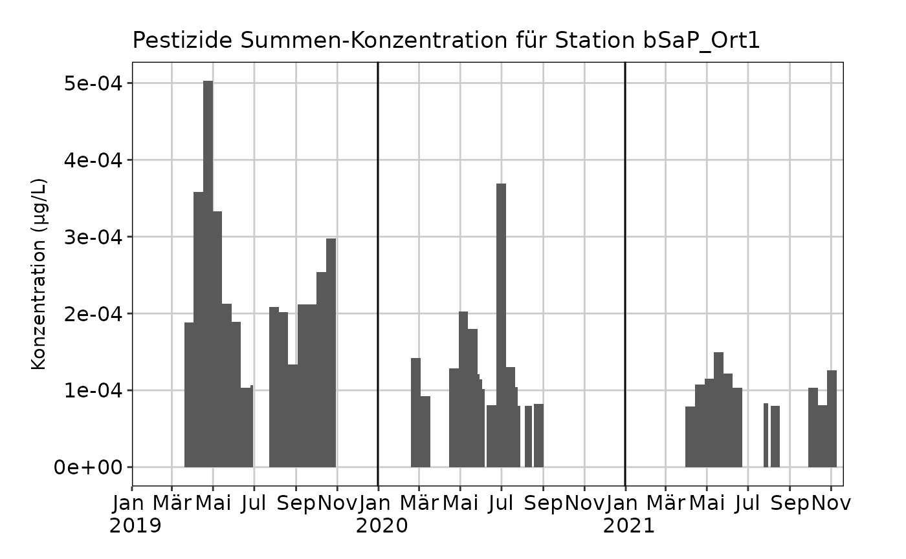

# Berechnete Mischproben

``` r
library(mvwizr)
#> mvwizr geladen: v1.3.2
```

## Einleitung

mvwizr unterscheidet grundsätzlich zwischen zwei verschiedenen
Probearten: Stichproben und Mischproben oder Sammelproben (mvwizr macht
keine Unterscheidung zwischen zeit- und abflussproportionalen
Mischproben). Bei den Sammelproben gibt es einerseits kurze Proben mit
einer Dauer von 3.5-Tagen, die gut geeignet sind um akute Belastungen zu
bewerten und zu finden und andererseits Zweiwochenmischproben (14-Tage),
die für die Beurteilung anhaltender Belastungen relevant sind. Teilweise
werden am gleichen Standort sowohl (phasenweise) 3.5-Tage-Mischproben
und 14-Tagemischproben genommen. In einigen Fällen wird im Anschluss aus
3.5-Tage-Mischproben rechnerisch eine 14-Tage-Mischprobe erstellt, eine
sogenannte **berechnete** Mischprobe.

mvwizr kann automatisch 3.5-Tage-Mischproben, die für die Berechnung von
berechneten 14-Tage-Mischproben verwendet wurden, aus dem Datensatz
entfernen. So wird sichergestellt, dass jede Probe nur einmal
gezählt/bewertet wird. Damit dies klappt, benötigt mvwizr eine Angabe
über die Art der Mischprobe: Intern verwendet das Paket die
Bezeichnungen `SaP` für tatsächliche Mischproben und `bSaP` für
berechnete Mischproben (angelehnt an die Nomenklatur des GBL).
Unglücklicherweise ist im NAWA-MV-Format des BAFU kein solches Attribut
definiert, resp. es wird nur zwischen Stichproben (mvwizr-intern `S`)
und Mischproben unterschieden.

Auch müssen diese zur Berechnung verwendeten 3.5-Tage-Mischproben
innerhalb des Intervalls der berechneten 14-Tage-Mischprobe liegen.
Falls die 3.5-Tage-Proben verschoben sind, so werden diese nicht korrekt
erkannt und entfernt!

## bSaP-Daten verarbeiten - Beispiel

Das folgende Beispiel soll aufzeigen, wie im Fall von NAWA-MV-Daten
dennoch konsistente Datensätze mit bSaP-Messungen eingelesen werden
können.

1.  Wichtig ist dabei, dass berechnete Mischproben und gemessene
    Mischproben (und ggf. Stichproben) in (zwei) unterschiedlichen
    Dateien vorliegen und im gleichen Vorgang mit
    [`batch_einlesen_nawa()`](https://ror-at-ebp.github.io/mvwizr/reference/batch_einlesen_nawa.md)
    eingelesen werden (damit die UID-Nummerierung stimmt). Beispiel:

``` r
mv_bsap_pfade <- system.file("extdata", c(
  "NAWA_ohne_bSaP_Bsp.xlsx",
  "NAWA_mit_bSaP_Bsp.csv"
), package = "mvwizr")
```

2.  Im nächsten Schritt muss nun manuell das “bSaP”-Attribut den Daten
    hinzugefügt werden (dort wo es sich um berechente Mischproben
    handelt). Da diese hier in einer separaten Datei vorlagen und der
    Dateiname im Dataframe enthalten ist, kann das Attribut ganz leicht
    korrekt gesetzt werden. Die Warnungen, die
    [`batch_einlesen_nawa()`](https://ror-at-ebp.github.io/mvwizr/reference/batch_einlesen_nawa.md)
    dabei zeigt, sollten aufmerksam gelesen werden - oft handelt es sich
    um Fälle von fehlenden Zuordnungen von Substanzen zur VSA-ID oder
    sonstigen Fehlern, die sich manuell beheben lassen.

``` r
mv_df_alle <- batch_einlesen_nawa(mv_bsap_pfade) |>
  # Wir setzen bSaP nur dort, wo die Daten aus der Datei mit den berechneten Mischproben stammen
  dplyr::mutate(PROBEARTID = dplyr::if_else(.data$filename ==
    "NAWA_mit_bSaP_Bsp.csv", "bSaP", .data$PROBEARTID))
#> ℹ Keine Import-Manifest-Datei angegeben. Lese Dateien ein und errate Funktionsparameter...
#> 
#> ── (1/2)  Lese NAWA_ohne_bSaP_Bsp.xlsx ... ─────────────────────────────────────
#> Warning: ! VSA-Lookup: 2 mehrfache Bezeichnungen (VSA Parameter-ID) pro Substanz_ID
#>   gefunden. Verwende tiefere Substanz_ID.
#> ℹ Betroffen: 8_2-FTCA, SiO2
#> ℹ Lese MV-Daten von Excel-Datei /home/runner/work/_temp/Library/mvwizr/extdata/NAWA_ohne_bSaP_Bsp.xlsx ein.
#> ℹ Versuche Start des Tabellen-Headers der Datei /home/runner/work/_temp/Library/mvwizr/extdata/NAWA_ohne_bSaP_Bsp.xlsx zu erraten.
#> ✔ Erkannter Header-Start: Zeile 8.
#> ℹ Versuche Sprache der Datei /home/runner/work/_temp/Library/mvwizr/extdata/NAWA_ohne_bSaP_Bsp.xlsx zu erraten.
#> ✔ Erkannte Sprache: DE.
#> ℹ Versuche Parameter-Feld der Datei /home/runner/work/_temp/Library/mvwizr/extdata/NAWA_ohne_bSaP_Bsp.xlsx zu erraten.
#> ✔ Erkannter Parameter: BAFU_Parameter_ID.
#> ! Bestimmungsgrenzen wurden nicht als Zahlen eingelesen - versuche Typenkonvertierung.
#> ℹ Normalisiere Einheiten der MV-Daten auf µg/l.
#> ℹ Max./min. Bestimmungsgrenzen der MV-Daten bestimmen...
#> 
#> ── (2/2)  Lese NAWA_mit_bSaP_Bsp.csv ... ───────────────────────────────────────
#> Warning: ! VSA-Lookup: 2 mehrfache Bezeichnungen (VSA Parameter-ID) pro Substanz_ID
#>   gefunden. Verwende tiefere Substanz_ID.
#> ℹ Betroffen: 8_2-FTCA, SiO2
#> ℹ Lese MV-Daten von Text-Datei /home/runner/work/_temp/Library/mvwizr/extdata/NAWA_mit_bSaP_Bsp.csv ein.
#> ℹ Versuche Encoding der Datei /home/runner/work/_temp/Library/mvwizr/extdata/NAWA_mit_bSaP_Bsp.csv zu erraten.
#> ✔ Erkanntes Encoding: UTF-8
#> ℹ Versuche Trennzeichen der Datei /home/runner/work/_temp/Library/mvwizr/extdata/NAWA_mit_bSaP_Bsp.csv zu erraten.
#> ✔ Erkanntes Trennzeichen: ;
#> ℹ Versuche Start des Tabellen-Headers der Datei /home/runner/work/_temp/Library/mvwizr/extdata/NAWA_mit_bSaP_Bsp.csv zu erraten.
#> ✔ Erkannter Header-Start: Zeile 1.
#> ℹ Versuche Sprache der Datei /home/runner/work/_temp/Library/mvwizr/extdata/NAWA_mit_bSaP_Bsp.csv zu erraten.
#> ✔ Erkannte Sprache: DE.
#> ℹ Lese NAWA-MV-Daten von /home/runner/work/_temp/Library/mvwizr/extdata/NAWA_mit_bSaP_Bsp.csv ein.
#> ℹ Versuche Parameter-Feld der Datei /home/runner/work/_temp/Library/mvwizr/extdata/NAWA_mit_bSaP_Bsp.csv zu erraten.
#> ✔ Erkannter Parameter: BAFU_Parameter_ID.
#> ℹ Normalisiere Einheiten der MV-Daten auf µg/l.
#> ℹ Max./min. Bestimmungsgrenzen der MV-Daten bestimmen...
#> ℹ Kombiniere MV-Daten aus 2 Dateien...
#> ✔ MV-Daten erfolgreich eingelesen und kombiniert.
```

3.  Im nächsten Schritt können die bSaP-Proben nun korrekt prozessiert
    werden:

``` r
mv_mit_bsap <- prozessiere_bSaP(mv_df_alle, bSaP_identifier = "PROBEARTID") |>
  dplyr::mutate(Dauer = difftime(.data$ENDEPROBENAHME,
    .data$BEGINNPROBENAHME,
    units = "days"
  ))

nrow(mv_mit_bsap)
#> [1] 59
```

4.  Alternativ können alle berechneten Proben über das Attribut auch
    herausgefiltert werden, wenn man alle 3.5-Tage-Proben im Dataframe
    behalten will:

``` r
mv_ohne_bsap <- mv_df_alle |>
  dplyr::filter(.data$PROBEARTID != "bSaP")

nrow(mv_ohne_bsap)
#> [1] 131
```

## MV-Daten im Vergleich

Der Vorteil dieses Vorgehens ist, dass die Datensätze nun einfach
verglichen werden können:

``` r
plot_misch_verlauf(mv_ohne_bsap, stationscode = "101099")
```



Es ist klar sichtbar, dass die Konzentrationsspitzen im Datensatz mit
den berechneten Mischproben stark rausgeglättet worden sind:

``` r
plot_misch_verlauf(mv_mit_bsap, stationscode = "101099")
```


