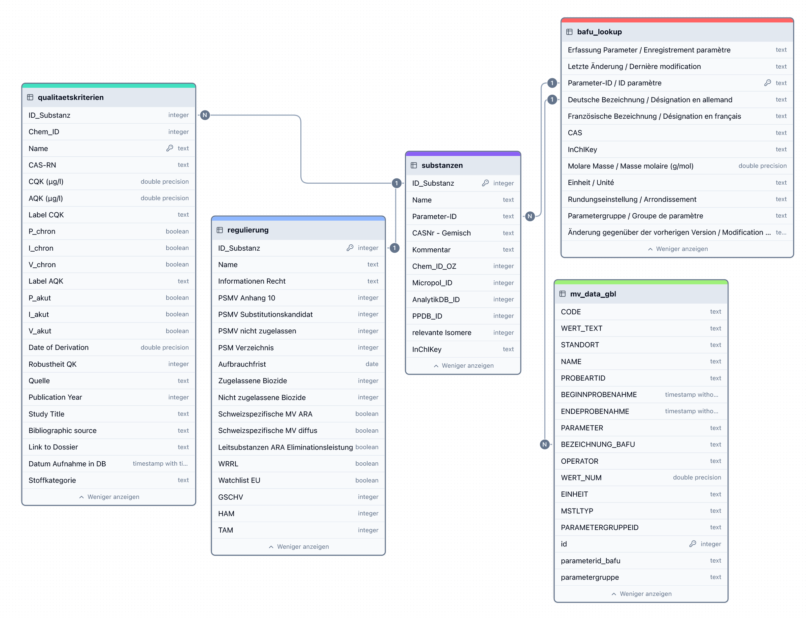

```{r, include = FALSE}
knitr::opts_chunk$set(
  collapse = TRUE,
  comment = "#>"
)
```

```{r setup}
library(mvwizr)
```

# Einleitung

Das vorliegende R-Paket mvwizr setzt Eingabedateien (für die `einlesen_*()` Funktionen) resp. Dataframes (Funktionen für Berechnungen und Visualisierungen) mit spezifizierter Struktur voraus. Im Grundsatz überprüft mvwizr nicht die genaue Struktur einer jeden Eingabe, sondern prüft das Vorhandensein bestimmter relevanter Elemente (v.a. Spaltennamen) und führt einige Tests durch um Daten zu validieren. Im Folgenden werden Eingaben mit den geforderten Strukturen beschrieben. Beispieldaten sind ebenfalls im Paket enthalten und referenziert.

# The Big Picture

Die verschiedenen hier benutzten Tabellen stehen in einer Beziehung zueinander, wobei die Regulierungsdaten und Qualitätskriterien nur über die VSA Substanz_ID zugänglich sind:

{width=100%}

## Mikroverunreinigungsdaten (Messdaten)

### MV-Daten GBL Kt. Bern

Die MV-Daten des GBL Kt. Bern sind kommagetrennte Textdaten, bei denen jede Zeile ein Messwert darstellt. Die folgenden Spalten müssen (mindestens) in den Daten enthalten sein. Dabei sind auch erwartete R-Datentypen und Formate angegeben:

| Variable          | Beschreibung                                                                                                           | Formatierung                     |
|-------------------|------------------------------------------------------------------------------------------------------------------------|----------------------------------|
| CODE              | Stationscode                                                                                                           | `character`                      |
| STANDORT          | Standort Station                                                                                                       | `character`                      |
| NAME              | Name des Gewässers                                                                                                     | `character`                      |
| PROBEARTID        | Art der Probe: Stichprobe (S), Mischprobe (SaP) oder berechnete Mischprobe (bSaP)                                      | `character`                      |
| BEGINNPROBENAHME  | Beginn der Probenahme                                                                                                  | `datetime` (DD/MM/YYYY hh:mm:ss) |
| ENDEPROBENAHME    | Bei Mischproben Ende der Probenahme. Bei Stichproben leer.                                                             | `datetime` (DD/MM/YYYY hh:mm:ss) |
| PARAMETERID_BAFU  | BAFU-Schlüssel für Substanz. Wird verwendet um Daten mit der VSA `ID_Substanz` zu verknüpfen.                          | `character`                      |
| BEZEICHNUNG_BAFU  | Deutsche Parameter-Bezeichnung des BAFU. Wird von Plotfunktionen verwendet für Beschriftungen.                         | `character`                      |
| OPERATOR          | Falls "<", liegt der Messwert unter der Bestimmungsgrenze und die Bestimmungsgrenze wird im Feld `WERT_NUM` angegeben. | `character`                      |
| EINHEIT           | Einheit des Messwertes in "ng/l" oder "pg/l"                                                                           | `character`                      |
| WERT_NUM          | Messwert oder berechneter Wert                                                                                         | `numeric`                        |
| MSTLTYP           | Messstellentyp                                                                                                         | `character`                      |
| PARAMETERGRUPPEID | Parametergruppencode des GBL                                                                                           | `integer`                        |
| PARAMETERGRUPPE   | Bezeichnung der Parametergruppe des GBL                                                                                | `character`                      |

Beispieldaten finden sich im Paket:

``` r
mv_beispiele <- c("Daten_Urtenentxt.txt", "Daten_Balmoosbach.txt", "Daten_Chruemlisbachxt.txt", "Stichproben_Sensetal.txt", "Daten_Balmoosbach_bsp_berechnet.txt")
system.file("extdata", mv_beispiele, package = "mvwizr")

```

### Andere MV-Daten

Andere MV-Daten müssen als dataframe/tibble vorliegen, wobei je eine Zeile eine Messung an einem Standort für eine bestimmte Substanz darstellt. Dabei müssen mindestens die folgenden Variablen vorhanden seine (siehe oben und auch auch `?mvdaten_beispiel_mvwizr` für Type jeder Variable):

* UID
* CODE
* STANDORT
* NAME
* PROBEARTID
* BEGINNPROBENAHME
* ENDEPROBENAHME
* PARAMETERID_BAFU
* BEZEICHNUNG_BAFU
* ID_Substanz
* WERT_NUM

Für die Anzeige der Bestimmungsgrenze ist BG_min und BG_max erforderlich.

## Regulierungen und Zulassungen

Hierbei handelt es sich um die Tabelle `anf_Substanz_recht_2024.xlsx` des VSA, welche Informationen zum Regulierungs- und Zulassungsstatus verschiedener Mikroverunreinigungen auflistet (zum Zeitpunkt/Jahr der Erstellung der Tabelle - in diesem Fall 2024). 

Die folgenden Spalten müssen (mindestens) in der Tabelle enthalten sein:

| Variable            | Beschreibung                                                                                                                         | Formatierung |
|---------------------|--------------------------------------------------------------------------------------------------------------------------------------|--------------|
| ID_Substanz         | VSA-ID                                                                                                                               | `integer`    |
| Name                | Stoffbezeichnung des VSA                                                                                                             | `character`  |
| Informationen Recht | Zeichenkette mit codierten Regulierungsinformationen                                                                                 | `character`  |
| GSCHV               | Gibt an, ob und wie die Substanz in der GSCHV reguliert ist. 1 = Spezifischer Wert in Anh. 2; 2 = allgemeiner Grenzwert von 0.1 µg/l | `integer`    |

Legende zu den `Informationen Recht`:

| ID_Recht | Rechtsordnung                              | Kürzel | Kommentar                                                                                                                     |
|----------|--------------------------------------------|--------|-------------------------------------------------------------------------------------------------------------------------------|
| 1        | PSMV Anhang 1                              | P      | Pflanzenschutzmittel   zugelassen im aktuellen Jahr in Verordnung und Verzeichnis                                             |
| 2        | PSMV   Anhang 10                           |        | Zu   überprüfende Pflanzenschutzmittel                                                                                        |
| 3        | PSMV   Substitutionskandidat               |        | Anhang 1   Abschnitt E - Substitutionskandidaten                                                                              |
| 4        | PSMV nicht   zugelassen                    | PX     | Pflanzenschutzmittel   Wirkstoffe im akutellen Jahr nicht zugelassen weder Verordung noch   Verzeichnis                       |
| 5        | Zugelassene   Biozide                      | B      | Biozide   mit einem Gesuch zur Zulassung                                                                                      |
| 6        | Biozide   non-inclusions                   | BX     | Biozide   die nicht zugelassen wurden                                                                                         |
| 7        | Schweizspezifische   MV ARA                |        | Liste von   C. Götz                                                                                                           |
| 8        | Schweizspezifische   MV diffus             |        | Liste aus   diffusem Projekt                                                                                                  |
| 9        | Leitsubstanzen   ARA Eliminationseistung   | ARA    | Leitsubstanzen   für die Überprüfung der Eliminationsleistung von ARA                                                         |
| 10       | WRRL                                       | WRRL   | Stoffe is   in der Wasserrahmenrichtlinie als Prioritär eingestuft                                                            |
| 11       | neue   Priortäre Stoffe WRRL               |        | Liste   neuer Prioritärer Stoffe der EU (Stand 2015)                                                                          |
| 12       | Watchlist   EU                             | WL.EU  | Stoff ist   auf der Watchlist der EU                                                                                          |
| 14       | GSCHV                                      | GSchV  | Anhang 2   GSchV mit subst. spezifischer, ökotox. begründeter num. Anf für anhaltende   Belastung in Gew. die nicht TW dienen |
| 15       | Arzneimittel                               | HA     | Human   Arzneimittel gemäss Liste der Swissmedic                                                                              |
| 16       | Tierarzneimittel                           | TA     | Tierarzneimittel   gemäss Liste der vetpham                                                                                   |
| 17       | PSM in   Verzeichnis aber nicht Verordnung | PX*    | Pflanzenschutzmittel   zugelassen im aktuellen Jahr nicht in Verordnung aber im Verzeichnis                                   |
| 18       | PSM in   Verordnung aber nicht Verzeichnis | PX°    | Pflanzenschutzmittel   zugelassen im aktuellen Jahr in Verordnung aber kein zugelassenes Produkt im   Verzeichnis             |

Eine Kopie dieser Tabelle befindet sich im Paket:

``` r
system.file("extdata", "anf_Substanz_recht_2024.xlsx", package = "mvwizr")

```

## Qualitätskriterien

Hierbei handelt es sich um Qualitätskriterien des VSA zu Mikroverunreinigungen. Die folgenden Spalten müssen (mindestens) in der Tabelle enthalten sein:

| Variable      | Beschreibung                                                                      | Formatierung |
|---------------|-----------------------------------------------------------------------------------|--------------|
| ID_Substanz   | VSA-ID                                                                            | `integer`    |
| CQK (µg/l)    | Chronisches Qualitätskriterium                                                    | `numeric`    |
| AQK (µg/l)    | Akutes Qualitätskriterium                                                         | `numeric`    |
| P_chron       | Gibt an, ob CQK zu berücksichtigen für Mischtoxizität bei Pflanzen                | `integer`    |
| I_chron       | Gibt an, ob CQK zu berücksichtigen für Mischtoxizität bei Invertebraten           | `integer`    |
| V_chron       | Gibt an, ob CQK zu berücksichtigen für Mischtoxizität bei Vertebraten             | `integer`    |
| P_akut        | Gibt an, ob AQK zu berücksichtigen für Mischtoxizität bei Pflanzen                | `integer`    |
| I_akut        | Gibt an, ob AQK zu berücksichtigen für Mischtoxizität bei Invertebraten           | `integer`    |
| V_akut        | Gibt an, ob AQK zu berücksichtigen für Mischtoxizität bei Vertebraten             | `integer`    |
| Robustheit QK | Robustheit des QK. Wert 1-3, wobei QK mit einem Wert von 3 nicht verwendet werden | `integer`    |

Eine Kopie dieser Tabelle befindet sich im Paket:

``` r
system.file("extdata", "Dat_Qual_kriterien.xlsx", package = "mvwizr")

```

## VSA-ID Lookup

Hierbei handelt es sich um eine Tabelle mit deren Hilfe die Parameter-ID des BAFU mit der Substanz_ID des VSA verknüpft werden kann. Die folgenden Spalten müssen (mindestens) in der Tabelle enthalten sein:

| Variable     | Beschreibung      | Formatierung |
|--------------|-------------------|--------------|
| ID_Substanz  | VSA-ID            | `integer`    |
| Parameter-ID | BAFU Parameter-ID | `character`  |

Eine Kopie dieser Tabelle befindet sich im Paket:

``` r
system.file("extdata", "Tab_Substanzen.xlsx", package = "mvwizr")

```

## BAFU Datenaustausch Lookup

Hierbei handelt es sich um eine Tabelle des BAFU um Deutsche und Französische Bezeichnungen für die Stoffe mit dem BAFU-Parameter-ID Schlüssel (Bezeichnung ohne Sonderzeichen) abzugleichen. Die folgenden Spalten müssen (mindestens) in der Tabelle enthalten sein:

| Variable                                           | Beschreibung             | Formatierung |
|----------------------------------------------------|--------------------------|--------------|
| Parameter-ID / ID paramètre                        | BAFU Parameter-ID        | `character`  |
| Deutsche Bezeichnung / Désignation en allemand     | Deutsche Bezeichnung     | `character`  |
| Französische Bezeichnung / Désignation en français | Französische Bezeichnung | `character`  |

Eine Kopie dieser Tabelle befindet sich im Paket:

``` r
system.file("extdata", "BAFU_Liste_Parameter_Bezeichnungen_Datenaustausch.xlsx", package = "mvwizr")

```
